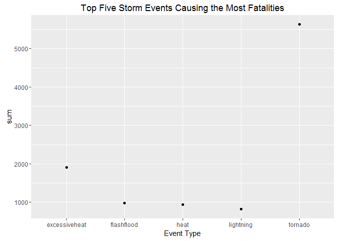
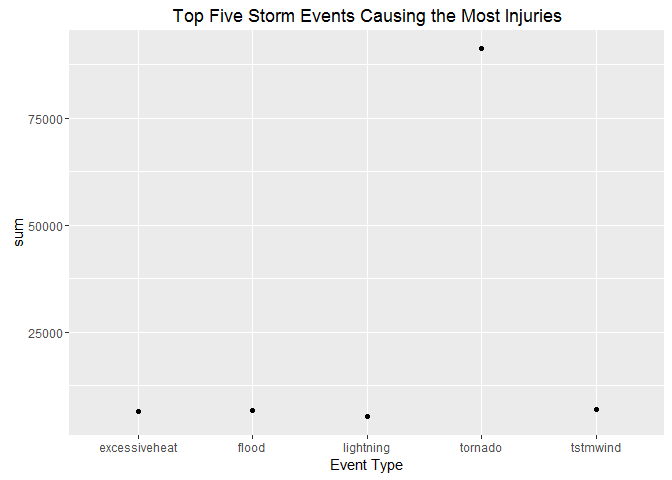

# Exploration of NOAA Data with Regard to Severe Storm Events
Janice Hunnings  
June 19, 2016  

##Synopsis:
Using the U.S. National Oceanic and Atmospheric Administration's (NOAA) storm
data, this report answers some basic questions with regard to severe storm
events such as:

1. Across the United States, which types of events are the most harmful with respect to population health?
2. Across the United States, which types of events have the greatest economic
consequences?

The events in the database begin in the year 1950 and end in November 2011.
In the earlier years of the database, there are generally fewer events 
recorded, most likely due to the lack of good records.  More recent
years contain more complete event data.


##Data Processing:

The data is first loaded into a data frame for use by R and then categorized
by event type (variable EVTYPE).  EVTYPE is a factor variable with 985 different occurences.  

Load storm data into a data frame.


```
## Warning: package 'plyr' was built under R version 3.2.4
```

```
## Warning: package 'ggplot2' was built under R version 3.2.5
```


```r
setwd("~/Data Science")
storm_data <- read.csv(bzfile("repdata_data_StormData.csv.bz2"))
```

The data is rather large with 902297 observations and 37 variables.  Let's attempt to subset this for greater manageability.

###Answer to the First Question.
Since the first question deals with most harmful to the population, this large NOAA data will be subset by injuries and fatalities.


```r
#First grab only the columns of interest EVTYPE, FATALITIES and INJURIES
harmful_data <- storm_data[,c("EVTYPE", "FATALITIES", "INJURIES")]
#Now reduce further by only pulling rows with non zero Fatalities and Injuries
harmful_data <- subset(harmful_data, harmful_data$FATALITIES > 0 | harmful_data$INJURIES >0)               
```

There are now 21,929 observations with 3 variables which is a much more manageable data frame.
Let's check on the Event types


```r
length(unique(harmful_data$EVTYPE))
```

```
## [1] 220
```
There are 220 different types of Event Types which can likely be cleaned and catergorized.  

First, let's change the event type to all upper case, remove 
spaces and check unique values again:


```r
harmful_data$EVTYPE <- tolower(harmful_data$EVTYPE)  
harmful_data$EVTYPE <- gsub(" ", "", harmful_data$EVTYPE)

length(unique(harmful_data$EVTYPE))
```

```
## [1] 203
```

Now there are 203 different Event Types.

Using ddply, two new data frames, one for Fatalities and one for Injuries are
created and ordered.  


```r
order_fatal <- ddply(harmful_data, "EVTYPE", summarize, sum = sum(FATALITIES) )
order_injury <- ddply(harmful_data, "EVTYPE", summarize, sum = sum(INJURIES) )
```

The top five number of storm events for fatalities are:

```r
of <- order_fatal[order(-order_fatal$sum)[1:5],]
```

The top five number of storm events for injuries are:

```r
oi <- order_injury[order(-order_injury$sum)[1:5],]
```

Now, plots are created that will clearly answer the question regarding which 
storm events are most harmful.  

1. Plot for Fatalities per Storm Event


```r
g <- ggplot(of, aes(EVTYPE, sum))
g <- g + geom_point() 
g <- g + ggtitle("Top Five Storm Events Causing the Most Fatalities") + xlab("Event Type")
g
```



2. Plot for Injuries per Storm Event


```r
g <- ggplot(oi, aes(EVTYPE, sum))
g <- g + geom_point() 
g <- g + ggtitle("Top Five Storm Events Causing the Most Injuries") + xlab("Event Type")
g
```



It is clearly seen by these graphs that Tornadoes cause the most fatalities and
the most injuries to the human population.

###Answer to the Second Question
The second data frame will be subset by the variables that reference Damage which
are PROPDMG, PROPDMGEXP, CROPDMG and CROPDMGEXP.    


```r
#First grab only the columns of interest for property damage which are
# EVTYPE, FATALITIES and INJURIES
prop_damage <- storm_data[,c("EVTYPE", "PROPDMG", "PROPDMGEXP")]
#Now reduce further by only pulling rows with non zero Fatalities and Injuries
prop_damage <- subset(prop_damage, prop_damage$PRPDMG > 0 | prop_damage$PROPDMGEXP >0)   
```

```
## Warning in Ops.factor(prop_damage$PROPDMGEXP, 0): '>' not meaningful for
## factors
```

```r
#Now create a second data frame for Crop Damage takeing the column of interest
# which are EVTYPE, CROPDMG and CROPDMGEXP 
crop_damage <- storm_data[,c("EVTYPE", "CROPDMG", "CROPDMGEXP")]
#Now reduce further by only pulling rows with non zero Fatalities and Injuries
crop_damage <- subset(crop_damage, crop_damage$CROPDMG > 0 | crop_damage$CROPDMGEXP >0)   
```

```
## Warning in Ops.factor(crop_damage$CROPDMGEXP, 0): '>' not meaningful for
## factors
```

## Analysis
