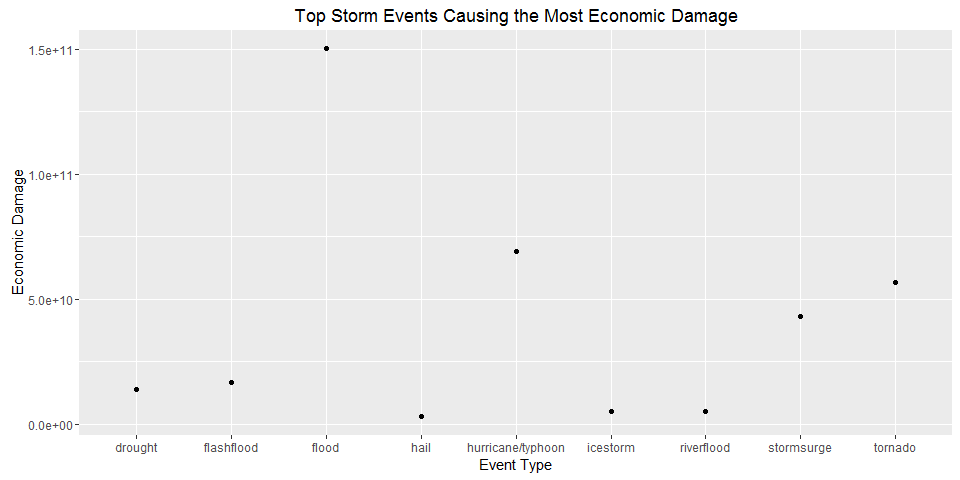

# Exploration of NOAA Data with Regard to Severe Storm Events
Janice Hunnings  
June 26, 2016  

##Synopsis:
Using the U.S. National Oceanic and Atmospheric Administration's (NOAA) storm
data, this report answers some basic questions with regard to severe storm
events such as:

1. Across the United States, which types of events are the most harmful with respect to population health?
2. Across the United States, which types of events have the greatest economic
consequences?

The events in the database begin in the year 1950 and end in November 2011.
In the earlier years of the database, there are generally fewer events 
recorded, most likely due to the lack of good records.  More recent
years contain more complete event data.


##Data Processing:

The data is first loaded into a data frame for use by R and then categorized
by event type (variable EVTYPE).  EVTYPE is a factor variable with 985 different occurences.  

Load storm data into a data frame.


```r
setwd("~/Data Science")
storm_data <- read.csv(bzfile("repdata_data_StormData.csv.bz2"))
```

The data is rather large with 902297 observations and 37 variables.  Let's attempt to subset this for greater manageability.

###Answer to the First Question.
Since the first question deals with most harmful to the population, this large NOAA data will be subset by injuries and fatalities.


```r
#First grab only the columns of interest EVTYPE, FATALITIES and INJURIES
harmful_data <- storm_data[,c("EVTYPE", "FATALITIES", "INJURIES")]
#Now reduce further by only pulling rows with non zero Fatalities and Injuries
harmful_data <- subset(harmful_data, harmful_data$FATALITIES > 0 | harmful_data$INJURIES >0)               
```

There are now 21,929 observations with 3 variables which is a much more manageable data frame.
Let's check on the Event types


```r
length(unique(harmful_data$EVTYPE))
```

```
## [1] 220
```
There are 220 different types of Event Types which can likely be cleaned and catergorized.  

First, let's change the event type to all lower case, remove 
spaces and check unique values again:


```r
harmful_data$EVTYPE <- tolower(harmful_data$EVTYPE)  
harmful_data$EVTYPE <- gsub(" ", "", harmful_data$EVTYPE)

length(unique(harmful_data$EVTYPE))
```

```
## [1] 203
```

Now there are 203 different Event Types.

Using ddply, two new data frames, one for Fatalities and one for Injuries are
created and ordered.  


```r
order_fatal <- ddply(harmful_data, "EVTYPE", summarize, sum = sum(FATALITIES) )
order_injury <- ddply(harmful_data, "EVTYPE", summarize, sum = sum(INJURIES) )
```

The top five number of storm events for fatalities are:

```r
of <- order_fatal[order(-order_fatal$sum)[1:5],]
of
```

```
##            EVTYPE  sum
## 167       tornado 5633
## 26  excessiveheat 1903
## 35     flashflood  978
## 60           heat  937
## 109     lightning  816
```

The top five number of storm events for injuries are:

```r
oi <- order_injury[order(-order_injury$sum)[1:5],]
oi
```

```
##            EVTYPE   sum
## 167       tornado 91346
## 174      tstmwind  6957
## 40          flood  6789
## 26  excessiveheat  6525
## 109     lightning  5230
```

Now, plots are created that will clearly answer the question regarding which 
storm events are most harmful.  

1. Plot for Fatalities per Storm Event


```r
g <- ggplot(of, aes(EVTYPE, sum))
g <- g + geom_point() 
g <- g + ggtitle("Top Five Storm Events Causing the Most Fatalities") + xlab("Event Type")
g
```


2. Plot for Injuries per Storm Event


```r
g <- ggplot(oi, aes(EVTYPE, sum))
g <- g + geom_point() 
g <- g + ggtitle("Top Five Storm Events Causing the Most Injuries") + xlab("Event Type")
g
```


It is clearly seen by these graphs that Tornadoes cause the most fatalities and
the most injuries to the human population.

###Answer to the Second Question
In order to answer the question about economic damage, we must create two 
data frames, one for property damage and one for crop damage.  The variables 
to be used are PROPDMG, PROPDMGEXP, CROPDMG and CROPDMGEXP.    


```r
#First grab only the columns of interest for property damage which are
# EVTYPE, PROPDMG and PROPDMGEXP
prop_damage <- storm_data[,c("EVTYPE", "PROPDMG", "PROPDMGEXP")]
#Now create a second data frame for Crop Damage taking the column of interest
# which are EVTYPE, CROPDMG and CROPDMGEXP 
crop_damage <- storm_data[,c("EVTYPE", "CROPDMG", "CROPDMGEXP")]
```


From these created data frames, it shows that the two variables PROPDMGEXP and 
CROPDMGEXP which are exponential values and need to be applied to PROPDMG and
CROPDMG, respectively, in order to accurately calculate the correct damage values.


```r
#This function will be used to calculate the exponent to use with the DMG variable
expon <- function(e) {
  if (e %in% "h") return(2)
  else if (e %in% "k") return(3)
  else if (e %in% "m") return(6)
  else if (e %in% "b") return(9)
  else if (!is.na(as.numeric(e))) return (as.numeric(e))
  else  {return(0)}
}

#In order to call the function, let's make the PROPDMGEXP and CROPDMGEXP
#consistent by changing them to lowercase and also remove values that are 0

prop_damage$PROPDMGEXP <- tolower(prop_damage$PROPDMGEXP) 
prop_damage <- prop_damage[(prop_damage$PROPDMG > 0),]
crop_damage$CROPDMGEXP <- tolower(crop_damage$CROPDMGEXP)
crop_damage <- crop_damage[(crop_damage$CROPDMG > 0),]

#Clean up the Event Type(EVTYPE) to lower case and remove spaces for future sorting.

prop_damage$EVTYPE <- tolower(prop_damage$EVTYPE) 
crop_damage$EVTYPE <- tolower(crop_damage$EVTYPE) 
prop_damage$EVTYPE <- gsub(" ", "", prop_damage$EVTYPE)
crop_damage$EVTYPE <- gsub(" ", "", crop_damage$EVTYPE)


#Apply the exponential function to correctly create totals.
tot_prop_expon <- sapply(prop_damage$PROPDMGEXP, FUN=expon)
tot_crop_expon <- sapply(crop_damage$CROPDMGEXP, FUN=expon)

prop_damage$Total <- prop_damage$PROPDMG * (10 ** tot_prop_expon)
crop_damage$Total <- crop_damage$CROPDMG * (10 ** tot_crop_expon)

#Using ddply, the totals are summarized.
Eco_prop_damage <- ddply(prop_damage, "EVTYPE", summarize, sum = sum(Total))
Eco_crop_damage <- ddply(crop_damage, "EVTYPE", summarize, sum = sum(Total))
```
The top five number of storm events for property damage are:

```r
pd <- Eco_prop_damage[order(-Eco_prop_damage$sum)[1:5],]
pd
```

```
##                EVTYPE          sum
## 54              flood 144657709807
## 155 hurricane/typhoon  69305840000
## 294           tornado  56947380677
## 249        stormsurge  43323536000
## 41         flashflood  16822723979
```

The top five number of storm events for crop damage are:

```r
cd <- Eco_crop_damage[order(-Eco_crop_damage$sum)[1:5],]
cd
```

```
##        EVTYPE         sum
## 9     drought 13972566000
## 25      flood  5661968450
## 74 riverflood  5029459000
## 68   icestorm  5022113500
## 38       hail  3025954473
```

Now, for clarity, a plot is created for Total Economic Damage per Storm Event.
This will combine both property damage and crop damage.


```r
m <- ddply(rbind(pd, cd), .(EVTYPE), summarize, sum_count = sum(sum))

g <- ggplot(m, aes(EVTYPE, sum_count))
g <- g + geom_point() 
g <- g + ggtitle("Top Storm Events Causing the Most Economic Damage") + xlab("Event Type") + ylab("Economic Damage")
g
```




From the lists and graph, it is obvious to see that Floods cause the most
economic damage. 

## Results

In summary, the answers to the following questions,  

1. Across the United States, which types of events are the most harmful with respect to population health?
2. Across the United States, which types of events have the greatest economic
consequences?

are obtained using just a few tools in R and the data from the U.S. National
Oceanic and Atmospheric Administration's (NOAA) storm data.  For accuracy, time and
analysis of the data was completed to clean it.

The storm events which are most harmful to human population health are tornadoes.
The storm events which are have the greatest economic consequences are floods.


